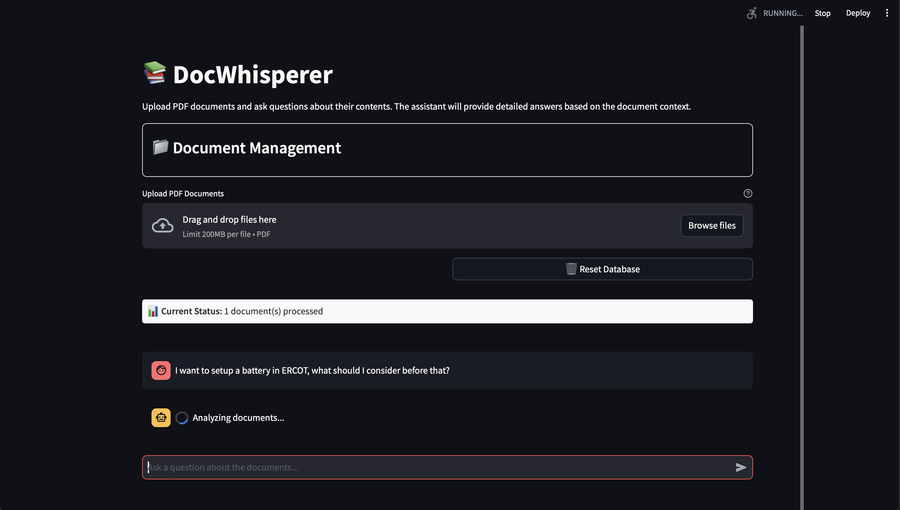
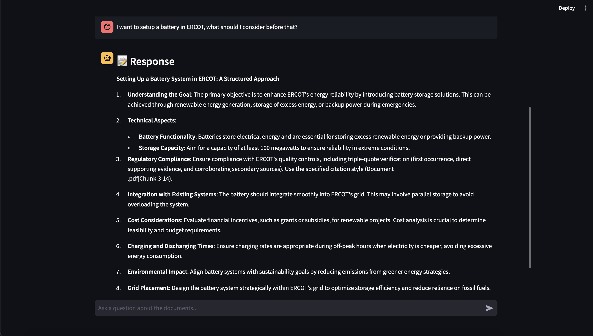

# DocWhisperer

A powerful document question-answering system using RAG (Retrieval Augmented Generation) technology. This application allows users to upload PDF documents and ask questions about their contents, receiving accurate answers based on the document context.



### Example Response Interface


## Features

- 📚 PDF document processing and storage
- 🔍 Semantic search using vector embeddings
- 🤖 Advanced LLM-based question answering
- 💻 User-friendly web interface
- 📊 Source tracking and analysis details
- ⚡ Performance optimizations with caching
- 🛡️ Robust error handling and logging

## Prerequisites

- Python 3.8+
- [Ollama](https://ollama.ai/) installed and running locally
- Sufficient disk space for document storage and vector embeddings

## Installation

1. Clone the repository:
```bash
git clone https://github.com/pushpendra-tripathi/docwhisperer.git
cd docwhisperer
```

2. Create a virtual environment (recommended):
```bash
python -m venv venv
source venv/bin/activate  # On Windows: venv\Scripts\activate
```
3. Install dependencies:
```bash
pip install -r requirements.txt
```

4. Create a `.env` file (optional):
```bash
CHROMA_PATH=chroma
DATA_PATH=data
DEFAULT_MODEL=deepseek-r1:1.5b
EMBEDDING_MODEL=snowflake-arctic-embed2
CHUNK_SIZE=800
CHUNK_OVERLAP=80
TOP_K_RESULTS=20
TEMPERATURE=0.0
```

## Usage

1. Start the web application:
```bash
streamlit run app.py
```

2. Open your browser and navigate to the provided URL (typically http://localhost:8501)

3. Use the sidebar to:
   - Upload PDF documents
   - Process uploaded documents
   - Reset the database if needed

4. Ask questions in the chat interface about the uploaded documents

## Project Structure

- `app.py`: Main Streamlit web application
- `query_data.py`: Core RAG query engine implementation
- `populate_database.py`: Document processing and database management
- `config.py`: Configuration settings
- `get_embedding_function.py`: Embedding model configuration
- `test_rag.py`: Test suite for RAG functionality

## Configuration

The application can be configured through environment variables or the `config.py` file:

- `CHROMA_PATH`: Directory for vector store
- `DATA_PATH`: Directory for uploaded documents
- `DEFAULT_MODEL`: Ollama model for question answering
- `EMBEDDING_MODEL`: Model for document embeddings
- `CHUNK_SIZE`: Document chunk size for processing
- `CHUNK_OVERLAP`: Overlap between chunks
- `TOP_K_RESULTS`: Number of relevant chunks to retrieve
- `TEMPERATURE`: LLM temperature setting

## Performance Optimization

The application includes several performance optimizations:

- LRU caching for document retrieval
- Efficient document chunking
- Optimized vector similarity search
- Retries for LLM queries
- Streamlined UI updates

## Error Handling

The application implements comprehensive error handling:

- Graceful handling of upload errors
- Retry mechanism for LLM queries
- Detailed error logging
- User-friendly error messages
- Database state validation

## Contributing

1. Fork the repository
2. Create a feature branch
3. Commit your changes
4. Push to the branch
5. Create a Pull Request

## License

This project is licensed under the MIT License - see the LICENSE file for details.

## Acknowledgments

- [LangChain](https://python.langchain.com/) for RAG implementation
- [Streamlit](https://streamlit.io/) for the web interface
- [Chroma](https://www.trychroma.com/) for vector storage
- [Ollama](https://ollama.ai/) for LLM integration

